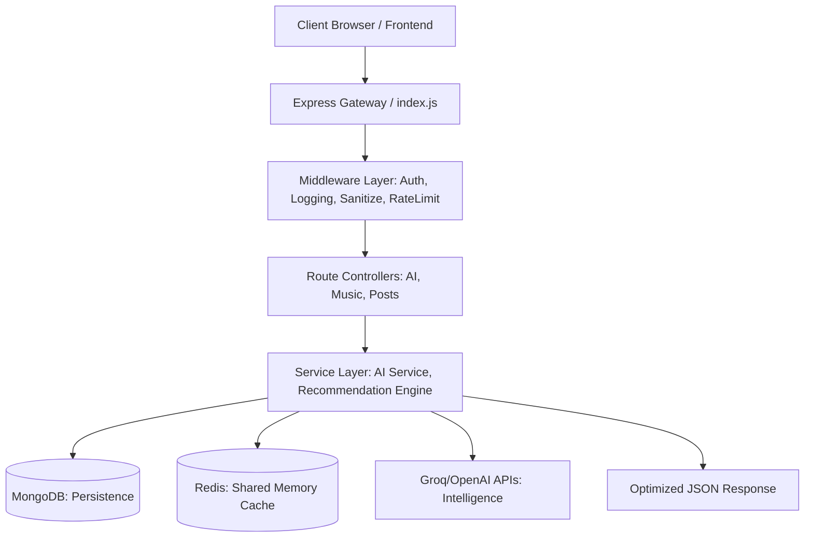

# 🧠 PostFeed - Fullstack AI System Design (Learning Version)

Welcome to the **Education & Learning** version of the PostFeed ecosystem. This branch is designed to turn the codebase into a high-level case study for senior backend patterns.

---

## 🧭 System Flow (Client-to-Core Architecture)

This diagram explains the complete request lifecycle, highlighting where performance and security are enforced:

### 🔁 Request Lifecycle Analysis

1.  **Client Entry**: The Vite-based React frontend initiates requests to the Express gateway.
2.  **Middleware Guard**: Before any logic runs, the request is sanitized (NoSQL Injection check), rate-limited, and validated against the `JWT_SECRET`.
3.  **Route Dispatch**: The router handles the separation of concerns, ensuring `Music` logic doesn't leak into `AI` logic.
4.  **Service Engine**: The "Brain" of the system. This layer decides whether to hit the external AI APIs or return the **Shared Redis Cache**.
5.  **Data Persistence**: Final state is stored in MongoDB, while transient performance data lives in the Redis cluster.

---

## 🛡️ Strategic Knowledge Layers

### 🔹 1. Cluster Orchestration (CPU Scaling)
**Why it exists:** Node.js is single-threaded. On a server with 8 cores, a standard app uses only 12.5% of the power.
**The Solution:** Our `server.js` uses the `cluster` module to fork 8 workers, utilizing 100% of the CPU and providing self-healing processes.

### 🔹 2. Shared Caching (Distributed Memory)
**The Challenge:** In Cluster mode, workers don't share memory. Local variables are isolated.
**The Solution:** We implement a **Redis Cache Service**. If Worker 1 generates an AI recommendation, Worker 2 can serve it instantly from Redis.

### 🔹 3. Security Hardening (NoSQL Injection)
**The Risk:** Malicious users can send payload like `{"user": {"$gt": ""}}` to bypass auth.
**The Fix:** We use `express-mongo-sanitize` to strip all `$` and `.` operators from the request body automatically.

---

## 🚀 Dual-Branch Documentation Contract
This repository follows an elite-standard maintenance strategy:

| Feature | `main` Branch (Production) | `learning` Branch (Education) |
| :--- | :--- | :--- |
| **Logic Source** | **Primary Truth** | Mirrored from main |
| **Comment Density** | Minimal (Clean Code) | High (Annotated Logic) |
| **Architecture Docs** | Concise Setup | Full System Design (This README) |
| **Interview Ready** | Portfolio Quality | Deep Technical Mastery |

---

## 💡 Engineering Insights
- **Singleton Pattern**: The `AI_Service` and `Music_Recommendation` engines use singletons to maintain a persistent state and unified provider logic.
- **Provider Fallback**: If Groq's LPU is at capacity, the system silently switches to OpenAI, ensuring zero downtime for the user.
- **Graceful Shutdown**: All infrastructure (DB, Caching, Worker processes) listen for `SIGTERM` to close existing requests safely before exiting.

---

*This README is intended for study and presentation during technical system design interviews.*
